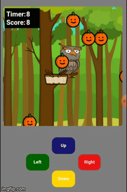

# Fruit Harvester

[Live Demo](https://johnhiro84.github.io/JohnHiro84/appacademy/fruitHarvester/fruit_harvester_small.html)
 
Test your skill as you gather fruit for the current harvest. Be sure to avoid any of the rotten red fruit as they diminish your total score. Pick up speed boosts along the way to maximize the amount of gathered fruit.

The player can either move in all four directions using a keyboard or with the on screen keyboard. See how many fruits you can catch in 60 seconds.

### Mobile Capability

The game was first designed to be used with a keyboard, but I decided to make the game available for mobile users as well. I designed an on screen keypad with the four directions by utilizing event listeners for key presses.

### Randomly Generated Fruit

The fruits are generated along a progression through time from a few fruits in the beginning to an abundance closer to the 60 second mark. The fruits and speed boosts are generated randomly along the x-axis creating varying scenarios in each game play.

### Future Features

Keeping track of the high score

Creating an item that temporarily doubles the basket size for more efficient fruit collection.
